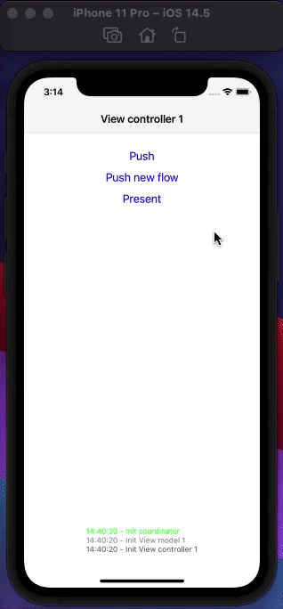

# CoordinatorsAutoHandled

An example of how coordinators don't need to handle child coordinators

[](demo.mp4)

## Briefly introduction

Usually, coordinator pattern in most of the articles requires to have a child coordinator list on every coordinator.

This is because we do not care about view hierarchy and only rely on manually retaining and releasing child coordinators using delegate pattern.

In this repository I want to expose a different way of handling this relation between coordinators. There's no need to retain child coordinators at all. Parent coordinators can create new coordinators and do not care about them because the view hierarchy will do that for us.

This does not mean we cannot still use delegate pattern if we still need to do specific actions. But we have absolutly freedom on handling back buttons, back swipe, dismiss swipe,...

## Architecture

To achieve this, we take profit of the fact that when a view controller is added to the view hierarchy, it is automatically retained. With this in mind, we just need to make a retaining chain like:

View hierarchy 1 <-> * View 1 <-> 1 View controller 1 <-> 1 View model * <-> 1 Coordinator

What does this means:

1. View hierarchy can retain one or many views
2. View controller's view retains the view controller itself
3. View controller is retaining the view model
4. View model retains the coordinator
5. Can exist more than one view model that is retaining the same coordinator
6. No one else is retaining the coordinator

In a nutshell, when a new view is added to the hierarchy (push, present, ...) this retains a view controller, a view model, and this view model retains the coordinator. Every new view in the same coordinator flow retains again the same coordinator. Once the view is dismissed, no matter how it is, the retain count for the coordinator is reduced by one. When there's no more views/view models in the view hierarchy, the coordinator is released with this last one.

## Key ponts:

### Coordinator

```swift
class Coordinator {
    weak var navigationViewController: UINavigationController?
}

extension Coordinator: ViewModelDelegate { ... }
```

Navigation controller on coordinators needs to be weak to not double retain them.

### View models

```swift
protocol ViewModelDelegate { /* Any callback from ViewModel to coordinator */ }

protocol ViewModelType { /* Callbacks or variables that view controller can access */ }

class ViewModel {
    let delegate: ViewModelDelegate
}
```

Note delegate is not weak. We want to retain coordinator here.

### View controller

```swift
class ViewController: UIViewController {
    let viewModel: ViewModelType
}
```

Again, we make view model not weak to ensure we are retaining it with the view hierarchy.

## Benefits

Completely free management of coordinators, no need to extra retain or release child coordinators, and it's still possible to make specific actions on dismiss, pop, deinit, whatever you need, using delegate pattern or any other pattern of your choice.

## Disadvantages

The only downside of this approach is that it might create some leaks if the retaining management of the views and view models haven't been done correctly. Causing that even if the view is dismissed, the coordinator is not, because even if the view is not in the hierarchy anymore, this is not released, so it's still retaining the view model and the coordinator.